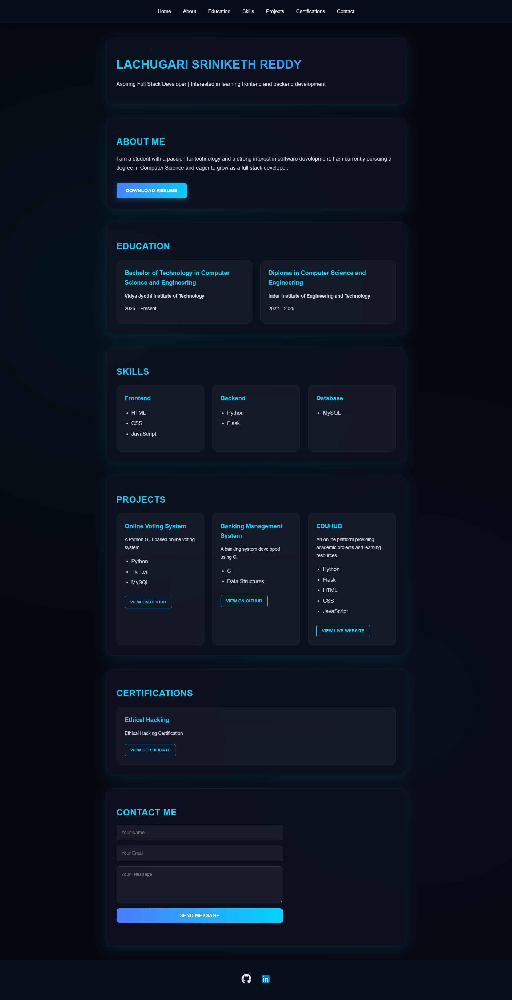

# 🌐 Personal Portfolio Website

A modern, responsive personal portfolio website built with **HTML**, **CSS**, and **JavaScript**. Features a sleek **neon blue dark mode** design with glassmorphism effects, smooth animations, and a fully working contact form.

### 🔗 **[Live Demo →](https://lsrinikethreddy.github.io/FUTURE_FS_01/)**

---

## 📸 Preview



---

## ✨ Features

- 🎨 **Neon Blue Dark Theme** — Modern dark mode with cyan/blue accent colors
- 🪟 **Glassmorphism Design** — Frosted glass effect on navbar and sections
- 📱 **Fully Responsive** — Looks great on desktop, tablet, and mobile
- 🎯 **Smooth Scrolling** — Seamless navigation between sections
- ✨ **Micro-Animations** — Hover effects, card lifts, and glowing buttons
- 🔗 **Active Section Indicator** — Navbar highlights current section while scrolling
- 📬 **Working Contact Form** — Sends messages directly to email via [Web3Forms](https://web3forms.com)
- 🛡️ **hCaptcha Protection** — Spam-proof contact form with captcha verification

---

## 📂 Project Structure

```
FUTURE_FS_01/
├── index.html                 # Main portfolio page
├── .nojekyll                  # Disables Jekyll on GitHub Pages
├── README.md                  # Project documentation
├── static/
│   └── style.css              # All CSS styles (fully commented)
└── assets/
    ├── preview.png            # Portfolio preview screenshot
    ├── icons/
    │   ├── github.png         # GitHub icon
    │   └── linkedin.png       # LinkedIn icon
    ├── LACHUGARI_SRINIKETH_REDDY_RESUME_CSE.pdf
    └── ethical_hacking_certificate.pdf
```

---

## 📄 Sections

| Section | Description |
|---------|-------------|
| 🏠 **Home** | Name and tagline with gradient text effect |
| 👤 **About** | Brief introduction with downloadable resume |
| 🎓 **Education** | Academic background (B.Tech & Diploma) |
| 💻 **Skills** | Frontend, Backend, and Database technologies |
| 🚀 **Projects** | GitHub projects with live links |
| 📜 **Certifications** | Professional certifications |
| 📬 **Contact** | Working contact form with email delivery |

---

## 🛠️ Technologies Used

| Technology | Purpose |
|-----------|---------|
| HTML5 | Structure & semantic markup |
| CSS3 | Styling, animations, glassmorphism |
| JavaScript | Interactive features, AJAX form submission |
| Web3Forms | Contact form email delivery |
| hCaptcha | Spam protection |
| GitHub Pages | Hosting |

### CSS Techniques Used:
- CSS Variables (Custom Properties)
- Flexbox & CSS Grid
- Glassmorphism (`backdrop-filter: blur()`)
- Gradient text effect
- Pseudo-elements (`::before`, `::after`)
- CSS Transitions & Transforms
- Media Queries for responsiveness

---

## 🎨 Color Palette

| Color | Hex | Usage |
|-------|-----|-------|
| 🔵 Background | `#050811` | Main dark background |
| 🔷 Primary Neon | `#00d4ff` | Accent color (cyan) |
| 🔹 Secondary Neon | `#4d7cff` | Secondary accent (blue) |
| ⚪ Text Main | `#f1f5f9` | Primary text |
| 🔘 Text Body | `#cbd5e1` | Body text |

---

## 👨‍💻 Author

**Lachugari Sriniketh Reddy**

- 🌐 Portfolio: [lsrinikethreddy.github.io/FUTURE_FS_01](https://lsrinikethreddy.github.io/FUTURE_FS_01/)
- 💻 GitHub: [@LSRINIKETHREDDY](https://github.com/LSRINIKETHREDDY)
- 🔗 LinkedIn: [lsrinikethreddy](https://www.linkedin.com/in/lsrinikethreddy/)

---

⭐ **If you found this helpful, please give it a star!**
